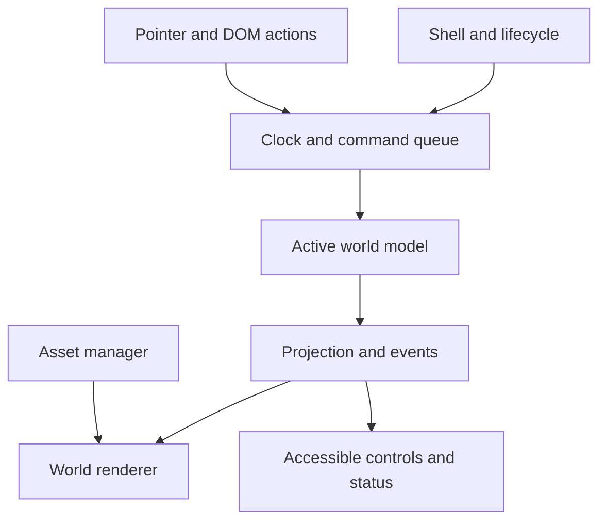

# Little Worlds: Technical Implementation Plan

Date: 2026-10-05. Status: implementation specification; no stage is declared complete by this document.

Source of scope: [Little Worlds roadmap](../little-worlds-roadmap.md). Repository baseline: `249ea3fd6a2f5523716aa9ef8b33884f4f9fdd8a`.

Audience: agents designing, implementing, reviewing, and releasing System Overflow. Read the roadmap and this plan before changing code. This plan covers all six roadmap stages, including visual production and visitor observation. It is not authorization to skip those stages and build the whole collection immediately.

## 1. Outcome, scope, and decision authority

Build a collection of small, living worlds that invites the visitor to **notice → intervene → see a reaction → discover a consequence → try differently**. The scene is the primary interface. A technically correct simulation without readable, appealing interaction does not satisfy the goal.

The first implementation candidate is a café. A greenhouse tests a fundamentally different model and is the candidate second finished world. An intersection is a deferred extension, not a requirement for the first release. The prototype contains a representative café fragment with two or three actions and a minimal greenhouse fragment with one action.

| Category | Instruction for implementing agents |
| --- | --- |
| Selected direction | Living little worlds, observable causality, exploration without compulsory lessons |
| Roadmap recommendations | Café first, greenhouse second, angled 2D dioramas; validate before treating these as final |
| Proposed technical defaults | TypeScript, Vite, a renderer adapter, static deployment, deterministic fixed-step models |
| Conditional renderer recommendation | Evaluate PixiJS v8 against the selected art and mobile requirements; record the result before production integration |
| Unresolved experience decisions | Pixel versus illustrated art, final actions, pacing, scene layouts, balance, collection entry screen |
| Outside initial scope | Accounts, backend, progress storage, scores, currency, world editor, plugin platform, forced lesson sequence |

Preserve the roadmap's product boundaries. An agent may choose routine implementation details and document them. Changing the central experience, adding a backend, or expanding the release portfolio requires an explicit project decision. A failed validation is a reason to revise the relevant stage, not to lower its acceptance criterion silently.

User-facing copy should initially remain Russian, matching the current site. Technical documentation, code identifiers, and agent handoffs should be English. Put visitor-facing strings in a small shared copy module so future translation does not require model changes; do not add an internationalization framework yet.

## 2. Repository assessment and migration strategy

The baseline is a dependency-free static application: `index.html`, `styles.css`, monolithic `app.js`, `flow-model.js`, `flow-model.test.cjs`, and `build-static.mjs`. `.openai/hosting.json` points to the existing Sites project and `dist`. The current model demonstrates abstract flows; its particles do not correspond one-to-one with simulated units.

1. Keep the current root experience working during design and prototype work. Do not reskin its graph and call it a café.
2. Introduce the new experience at `/worlds/` using a real `worlds/index.html` build entry. Use hash navigation such as `/worlds/#cafe` and `/worlds/#greenhouse`; a static host must not need SPA rewrite rules.
3. During the prototype, build both entries into `dist`. Keep the legacy files' relative paths valid, and test both pages. Replace the copy-only build with Vite only when the new bootstrap is ready; document the new command in README in the same PR.
4. Evaluate reusable flow invariants and algorithms. Reuse only components that match physical café rules and pass domain tests. Do not introduce fractional customers or arbitrary old network splits to preserve old code.
5. After the release gate, move Little Worlds to the root entry. If retaining the old experience at `/legacy/`, explicitly copy or adapt all its relative resources and test direct loading. Preserve old behavior in git history regardless.
6. Retire obsolete build scripts only once their replacements are validated. Preserve the existing Sites project identity and static output location. This documentation change does not require a deployment.

Use small PRs corresponding to the work packages below. Avoid mixing asset style decisions, simulation rewrites, and release migration in one unreviewable change.

## 3. Stage map and required deliverables

Paths in this table are planned artifacts, not claims that those files exist yet.

| Roadmap stage | Work packages | Required artifacts | Exit gate |
| --- | --- | --- | --- |
| 1. Concept | C01 | `concept.md` | First 30 seconds, next action, entry and return behavior are concrete |
| 2. Visual language | V01–V02 | `visual-language.md`, matched reference scenes, asset inventory | Style and production rules selected; interactions readable on narrow and wide screens |
| 3. Café scenario | S01–S02 | `cafe-scenario.md`, `greenhouse-scenario.md` | Every proposed action has a causal chain, limits, timing, and accessible equivalent |
| 4. Architecture | A01–A03 | `architecture.md`, `decisions.md`, contract and toolchain | Both domains fit without shared queue physics; rendering spike passes |
| 5. Prototype | P01–P06 | Working café, minimal greenhouse, `prototype-review.md` | Technical checks and actual visitor observation support advancement |
| 6. Collection | R01–R04 | Two completed worlds, `release-checklist.md`, updated README | Release build passes device, interaction, resource, and experience checks |
| Deferred extension | X01 | `intersection-scenario.md`, separate implementation proposal | Adds a distinct experience after the first collection is validated |

All documents above live under `docs/little-worlds/` unless otherwise stated. Record evidence and open issues at each gate. Calendar estimates are intentionally absent; estimate work after art inventory and scenario scope are known.

## 4. Stage 1: concept specification — C01

Deliver `concept.md` before production implementation. Specify:

- Visitor context: someone opens a shared link out of curiosity, without systems terminology.
- A concrete first-visit sequence at 0–10 and 10–30 seconds: visible life, discoverable object, initial reaction, a reason to act again. Times are experience hypotheses, not scripts that force outcomes.
- Whether the collection opens directly into the café or a selection screen. Recommended prototype default: a living café with unobtrusive world navigation.
- Behavior during observation without input, repeated input, reset, long visits, and a return visit.
- Why each world is enjoyable and what causal relationship it makes visible. Separate these from optional explanatory copy.
- Release boundaries and unresolved hypotheses, with the next test for each.

Acceptance: a reviewer can describe the first interaction and subsequent exploration without inventing missing mechanics. Avoid dashboard-first layouts, long introductions, explicit correct-answer prompts, and compulsory completion flows.

## 5. Stage 2: visual specification and asset pipeline — V01–V02

### V01: matched style comparison

Produce pixel and illustrated treatments of the **same** café scene, with identical camera, actors, queues, action targets, and system state. Include wide and narrow viewport presentations at actual display size. Compare action discoverability, silhouettes, causal readability, movement potential, and asset production cost. A beautiful static illustration alone does not settle the choice.

`visual-language.md` must specify camera, logical scene size, safe composition regions, layers and occlusion, palette, object proportions, shadows, typography, action/focus markers, state signals, and motion rules. Include reference states: idle, working, waiting, overloaded, intervention accepted, and action unavailable. Distinguish these by shape, pose, motion, or labeling as well as color.

Test at least a 390 × 844 CSS-pixel portrait viewport and a 1440 × 900 desktop viewport. Also inspect 320 CSS-pixel width and short landscape layouts. These are initial test fixtures; record real target devices at A01. Do not approve unreadable downscaled artwork because it looks good in a large image.

### V02: production contract

Use `art-source/` for reproducible source material when practical and `public/assets/worlds/<world-id>/` for exported runtime assets. Large editable sources may be stored outside git if their durable location and export procedure are documented; production exports and manifests must remain reproducible and available to implementers.

Each asset entry records: stable key, world, file path, source/provenance and usage rights, dimensions, logical scale, pivot, animation frames and durations, layer, hit region, and fallback behavior. Each world has a manifest version. Replacing artwork must not change model identifiers.

Create an inventory with required states, frame count, reuse candidates, priority, owner, and approval status. Café minimum inventory: environment, customer silhouettes and waiting poses, preparation and serving work, order/plate representation, three action-target states, focus markers, and restrained feedback effects. Greenhouse minimum: environment, plant stages/stress signals, water and light signals, one representative intervention.

Export transparent sprites without fringes; verify pivots across animation frames and atlas padding. Decide texture filtering after choosing style: pixel art needs crisp scaling; illustrated art must be checked for blurring at its intended size. Do not manufacture critical text inside raster art. Keep text and accessible labels in DOM.

Author a reference animation sheet specifying durations, looping, interruptions, and pause behavior. Main characters and meaningful state changes need production-representative art in the prototype. Decorative background details may remain placeholders. Record asset generation/editing inputs where relevant; inspect actual exports before importing them.

Acceptance: another agent can produce a new object consistent with the scene without choosing a new style. Asset import validation catches missing files, invalid dimensions/frames, duplicate keys, and absent provenance.

## 6. Stage 3: scenario and causality specifications — S01–S02

### S01: café director specification

Accepted scope update (2026-10-07): use [cafe-scenario.md](cafe-scenario.md) and D002 in [decisions.md](decisions.md). The three interventions are kitchen pace, one serving/cleanup helper and entrance admission. Implement the complete customer/order/table lifecycle, including eating, departure and cleanup before table reuse. This scope decision does not complete numerical tuning or S01 acceptance.

For every action, specify target, gesture, keyboard equivalent, precondition, command payload, immediate feedback, delayed consequence, latency range, visible evidence, repetition limit, reversibility, and behavior while paused. Add composition sketches showing where attention travels through the causal chain.

Proposed actions to evaluate, rather than mechanically implement:

| Candidate | Model change | Immediate scene reaction | Later observable consequence |
| --- | --- | --- | --- |
| Change preparation capacity | Select a bounded preparation level | Equipment/worker acknowledges the accepted level | Preparation queue changes; ready orders may accumulate at serving |
| Change serving capacity | Select a bounded serving level | Serving station changes activity | Ready-order backlog changes if work is available |
| Reduce or redirect incoming demand | Change a clearly bounded arrival policy | Entry object changes state | Upstream waiting changes after arrivals respond; throughput need not rise |

Use two or three actions that fit the final fiction. If “capacity” means an extra worker, account for that worker physically; if it means equipment speed, animate that equipment. Avoid silently teleporting a worker between simultaneous jobs. Show unused capacity naturally when the downstream or upstream constraint dominates.

Choose a baseline seed that generates a visible problem through normal rules. Define expected observation windows with tolerances and counterfactual scenarios. A scheduled animation that announces a new bottleneck regardless of model state is prohibited. Do not reproduce the legacy C1 → D → output sequence as a script.

Specify what happens with no intervention, a weak intervention, reversed interventions, maximum levels, fast repeated taps, gesture cancellation, reset during feedback, and navigation during loading. Keep the world interesting after the first causal discovery.

### S02: greenhouse contrast specification

Implementation baseline: [greenhouse-scenario.md](greenhouse-scenario.md) specifies one fixed watering dose, normalized soil/root/posture dynamics, accumulated excess and delayed response. Its reference traces/checks support S02 design; playable review, production timestep/lifecycle tests and visual/visitor evidence remain pending.

Define one intervention and a delayed response for the prototype, then candidates for the finished second world. Choose stylized physical quantities and units: soil moisture, light exposure, temperature or ventilation, and plant response. Record their limits and simplifications.

Describe the difference between an immediate environmental change and slower plant response. A plant cannot instantly recover simply because a recovery animation plays. Define how a visitor notices waiting, cumulative influence, and excessive correction without reading a parameter panel.

Acceptance for both scenarios: every meaningful visual signal maps to a named model condition or accepted command, and every action has an observable outcome or understandable lack of effect. Include muted audio and reduced-motion presentations.

## 7. Stage 4: architecture and toolchain — A01–A03

### A01: select and document the stack

Proposed baseline: strict TypeScript, Vite static builds, npm with a committed lockfile, plain DOM shell, and PixiJS v8 behind a renderer adapter. Add Vitest for model/core tests and Playwright for production-build browser checks. Do not add React, a global store, an ECS, workers, or a backend without a concrete need demonstrated by the prototype.

At bootstrap, verify compatible supported package and Node versions using official documentation. Pin the chosen runtime and commit the resolved lockfile; do not assume this plan specifies the latest release. Document installation and clean-checkout commands. Required script intent:

| Script | Responsibility |
| --- | --- |
| `dev` | Local development with the new and legacy entries |
| `typecheck` | TypeScript checking without relying on bundler transpilation |
| `test` | Non-browser deterministic models and runtime tests, one-shot in CI |
| `test:e2e` | Browser interactions against the built app |
| `validate:assets` | Manifest and runtime-export validation |
| `build` | Clean static production output in `dist` |
| `preview` | Serve the built output for local QA |
| `check` | Aggregate typecheck, unit tests, asset validation, and build |

Retain `node --test flow-model.test.cjs` while legacy behavior is maintained. CI runs clean installation, `check`, legacy tests, and browser checks once those tests exist. A browser runner unavailable in one environment is an explicit unverified item, not a pass.

### A02: rendering spike

Render a production-representative café crop with animated actors, target picking, resize, and a greenhouse state change. Measure actual devices, not only an empty canvas. Verify selected filtering, atlas loading, layering, mobile readability, interaction latency, and teardown.

For PixiJS v8, use asynchronous Application initialization and `app.canvas`. Choose one clock owner: initialize without an automatically running ticker and let the shared runtime schedule simulation and rendering. Do not allow a library ticker and a custom animation loop to advance the model independently. Start with WebGL preference; a rendering initialization failure must show a readable error and retry route rather than a blank screen.

Record the chosen renderer and rejected alternatives in `decisions.md`, including bundle/load cost and device evidence. Switching renderer later should require replacing rendering adapters, not rewriting world rules.

### A03: module boundaries and project layout

Proposed layout; adjust names once in `architecture.md` before agents work in parallel:

```text
src/
  main.ts
  app/          shell, navigation, lifecycle, copy, user preferences
  core/         clock, command queue, seeded RNG, replay, shared contract
  rendering/    renderer adapter, camera transforms, asset manager, effects
  interaction/  pointer gestures, target picking, keyboard/DOM action bridge
  worlds/
    cafe/       model, types, config, actions, projection, view, manifest
    greenhouse/ model, types, config, actions, projection, view, manifest
  debug/        development-only inspection and replay controls
public/assets/worlds/
art-source/
tests/          core/model and browser integration fixtures
scripts/        asset validation and build support
worlds/index.html
```

Models import domain code and deterministic core helpers only. They must not import DOM, PixiJS, browser time, audio, or app navigation. Views consume immutable projections and event batches; they cannot mutate model state. The shell owns active-world lifecycle; the renderer owns display objects; the asset manager owns shared textures and reference counts. World-specific rules never migrate into the clock to make one world easier.



`architecture.md` contains actual module ownership, lifecycle, chosen contracts, clock algorithm, rendering ownership, coordinate transforms, and build routes. `decisions.md` uses short decision records: status, problem, choice, evidence, alternatives, consequences, and conditions for revision.

## 8. World contract and deterministic execution

The following is a contract proposal to ratify at A03, not a finished reusable SDK. Keep concrete world types behind a typed registration factory; avoid erasing every command to `any` in the registry.

```ts
type Tick = number;
type CommandId = string;

type Command<C> = Readonly<{
  id: CommandId;
  runId: string;
  tick: Tick;
  sequence: number;
  payload: C;
}>;

type WorldEvent<E> = Readonly<{
  id: string;
  tick: Tick;
  payload: E;
  causedBy?: CommandId;
}>;

type Transition<S, E> = Readonly<{
  state: S;
  events: readonly WorldEvent<E>[];
}>;

type CommandResult<S, E> =
  | { accepted: true; transition: Transition<S, E> }
  | { accepted: false; reason: string };

interface WorldModel<S, C, E, P> {
  create(seed: number): S;
  apply(state: S, command: Command<C>): CommandResult<S, E>;
  step(state: S, tick: Tick, dtSeconds: number): Transition<S, E>;
  project(state: S): P;
  actions(state: S): readonly ActionDescriptor<C>[];
}
```

Define `ActionDescriptor<C>` with stable action and target IDs, accessible label, available payload choices, bounds/current value where applicable, enabled status, and an unavailable reason. Store logical target geometry in scene/view configuration, not simulation state. Pointer and DOM controls must use the same action registry and command validation.

A registered world adds metadata, lazy asset/model/view loading, a scenario version, and a view factory. The view lifecycle includes mount, resize, render(previous/current projection, interpolation fraction, events), update preferences, and idempotent dispose. Do not require a greenhouse model to expose orders, queues, or routing nodes.

### Clock and command ordering

- Default simulation quantum: `1/60` second. Start integer tick at zero; model time derives from tick. Tune domain rates, not clock step, to achieve readable pacing.
- On each active animation frame, accumulate elapsed time and execute fixed ticks. Bound a frame delta to 100 ms and at most six ticks per frame. Discard excess backlog and record a development diagnostic; under overload the world slows rather than jumping forward. These are proposed initial settings to measure, not universal performance guarantees.
- Assign input to the next unexecuted tick; process commands in `(tick, sequence)` order before stepping that tick. Commands arriving after a tick is consumed go to the next tick. Include accepted and rejected commands in replay diagnostics.
- Render interpolated positions from previous/current snapshots. Discrete state changes occur at tick boundaries; do not interpolate identities, queue membership, accepted commands, or completed orders.
- Seed model randomness independently from decorative randomness. Keep RNG state in model state; use stable entity IDs and iteration order. No `Math.random()`, `Date.now()`, or uncontrolled asynchronous callbacks inside models.
- Record replay schema version, world ID, scenario/config version, seed, fixed step, ordered commands, and ending tick. Reject incompatible replay versions visibly. Same runtime/version, seed, config, commands, and ending tick must produce equal canonical model state. Cross-engine bitwise floating-point identity is not a release promise; greenhouse invariants additionally use explicit tolerances.
- Events carry model tick and causal command IDs when directly traceable. For multi-cause outcomes, record relevant domain entity/condition data rather than inventing a single cause. Ordinary autonomous events have no command cause.
- Drain each event batch once. Cache only bounded diagnostic history in development; do not accumulate all events for an endless visit.

### Lifecycle and cancellation

States: idle → loading → running; running ↔ paused; running/paused → resetting; any active state → unloading → idle; failures → error with retry. Implement transition guards and test races.

Use separate pause reasons (`user`, `hidden`, and temporary lifecycle reasons). Hiding the document stops model and causal animation time and clears the accumulator. Returning clears elapsed-time origin and resumes only if no other pause reason remains. There is no background catch-up and no hidden progress. Pause also stops model-related audio/effects; focus and hover feedback may remain available.

Prototype default: switching worlds resets the departing world; returning starts its standard seed again. Reset reproduces the same seed/config, allowing comparison of interventions. This is a proposed concept decision to confirm in C01. Future persistent sessions must be explicit and must not advance an inactive world implicitly.

Reset/unload cancels gestures, queued input, model event deliveries, delayed effects, audio voices, and world loads. Use a generation/run token to reject stale async completions. A renderer may not mount after its world has been replaced. Dispose is safe twice. Shared assets release through ownership/refcounts; destroying one view must not destroy a texture still in use.

## 9. Domain implementations

### Café — P01

Represent individual customers/orders with stable IDs and mutually exclusive stages. A proposed minimal flow is arriving → waiting to order → preparing → ready → serving → served/exit. Final stage boundaries depend on S01. Separate an order's processing state from its visual position.

Model preparation and serving as explicit service stations with bounded capacities, current work, and progress measured in model time. Define queue discipline, finite waiting areas, transfer eligibility, and backpressure. A completed preparation cannot duplicate an order or deposit it in an already full serving buffer. Hold it at the origin until transfer is valid, unless the scenario explicitly defines an alternative.

Specify whether capacity changes affect an in-progress job immediately or the next job; use one documented rule. Arrival randomness derives from the seeded model. Prevent unlimited customer growth: finite admission/waiting capacity, then observable waiting outside, rejection, or another explicitly designed policy. If abandonment is included, use a domain transition with a visible reason, not silent deletion.

Required invariants:

- Created orders equal active orders plus terminal orders (served, rejected, abandoned, or cancelled if those states exist).
- An order occupies exactly one processing stage; IDs are unique and progress is finite and nonnegative.
- Queue and buffer sizes respect limits; busy workers/stations do not exceed capacity.
- Transfer and completion are atomic; rendering cannot create or complete an order.
- Counters may retain historical totals, but exited entity records are bounded or removed according to a documented policy.

Projection includes actor poses/paths, station work state, finite queue slots, visible order status, and action availability. Use discrete slots or authored paths before considering pathfinding. Long-distance movement belongs to model time if arrival changes service availability; ornamental walking offsets belong only to the view.

Scenario tests must demonstrate: no-action baseline, meaningful preparation improvement, downstream accumulation where physically possible, serving improvement, unused capacity, reversals, and maximum limits. Assert actual state/throughput windows, not a scripted “bottleneck moved” flag. Unit tests do not need the renderer.

### Greenhouse — P04 and R02

Use bounded environmental quantities and a response state with a measurable lag. One candidate formulation is soil moisture updated by irrigation minus evaporation/uptake, then plant response approaching an environment-dependent target over a configured time constant. Choose and document actual equations, units, valid ranges, and coefficients in S02; do not import arbitrary coefficients as realistic horticultural claims.

Advance with the common fixed step. Bound controls; reject invalid commands; prevent NaN and unstable updates. Store accumulated exposure or response state rather than implementing delays with `setTimeout`. Light or ventilation changes environment first, then response evolves. A reset removes all accumulated exposure and pending domain transitions.

Required tests: valid boundaries, long runs, no input, beneficial intervention, excessive intervention, reversals before response completes, identical seed/replay, and invariance to rendering schedules. Verify that command impact and visible response occur at distinct model times. State remains bounded and numerically stable for at least 30 simulated minutes under extreme permitted controls.

The minimal greenhouse must use the same clock, lifecycle, command bridge, asset loader, and accessibility route as the café. If integration requires adding plant-specific fields to the core, revise the contract before expanding either world.

## 10. Scene, interaction, accessibility, and audio — P02–P03

### Rendering and composition

Maintain logical world coordinates, a scene camera transform, and its inverse for hit testing. Resize changes composition and projection, not model rules. Define a portrait layout with relocated furniture/queues or camera framing as necessary; do not merely shrink the desktop canvas. Ensure every significant action and downstream consequence remains visible or can be reached through a clear scene control.

Use stable layer groups: environment, actors/props with documented depth ordering, causal signals, feedback, and DOM shell. Keep foreground decorations from blocking targets. Pool transient display objects and cap particles. Derive animation state from projections; accepted-event feedback is temporary and cannot impersonate a model outcome.

### Input rules

Default to click/tap actions unless S01 demonstrates a need for holding or dragging. If a gesture uses a duration, define its threshold, visible progress, cancellation, movement tolerance, and release semantics. One activation submits one command. Suppress duplicate pointer/click paths; handle pointer cancellation, leaving the target, lost capture, orientation changes, reset, and navigation.

Give immediate input feedback within the next rendered frame, then accepted/rejected feedback when the model validates. If paused, disable world-changing actions with a visible reason by default; reset, navigation, and resume remain usable. Never silently mutate paused state through DOM controls while pointer controls are disabled.

### Accessible DOM bridge

The canvas is not the only operation route. Provide concise world description, actual DOM action buttons/controls, pause/reset/navigation, visible focus, and useful unavailable explanations. Keep labels consistent with scene targets. Focus order follows the scene's action sequence; focus highlights its target. Enter/Space and standard controls must generate the same commands as tapping.

Do not announce every tick or customer movement. Update a polite status region for significant accepted changes and consequences with throttling. Use text/shape/pose alongside color; ensure controls and text have sufficient contrast and support browser zoom. Aim for at least 44 × 44 CSS-pixel action hit regions, enlarged independently of sprite size when needed. Avoid hover-only discovery.

Support `prefers-reduced-motion` and an explicit motion preference: suppress camera jolts, particles, and unnecessary oscillation; keep meaningful state transitions visible through poses, brief changes, and status copy. Core model speed and rules stay the same. Validate keyboard-only, touch, muted sound, reduced motion, and 200% zoom manually as well as with browser automation.

### Audio

Optional audio starts only after a visitor gesture. Default to a discoverable mute control and handle playback restrictions without blocking simulation. Derive meaningful cues from accepted events; cap simultaneous voices and stop them on reset/unload. Audio never carries exclusive information. Audio polish may follow the prototype gate; muted operation is required from the first playable fragment.

## 11. Resource loading and performance budgets

Load the shell first and the active world's assets next. Load the other world on explicit navigation or restrained idle prefetch. Show progress/error/retry in DOM. Differentiate a missing decorative asset (safe fallback) from missing critical scene/action art (block the scene with an actionable error). Validate manifests before mounting; do not show an interactive invisible target.

Initial proposed budgets, to ratify after A02 on named devices:

| Metric | Initial target and measurement |
| --- | --- |
| Input acknowledgement | Within 100 ms at p95 during normal interaction; measure input-to-visible feedback |
| Render performance | Aim for 60 fps on the reference desktop and at least 30 fps on the reference phone during the busiest supported scene |
| First-world transfer | At most 3 MB compressed shell + code + first-world assets, excluding optional audio; report separate components |
| Decoded textures | At most 64 MiB for the active world and shared art; estimate decoded dimensions and compare runtime behavior |
| Entity/effect limits | Explicit per-world active-entity, queue-slot, particle, and audio-voice caps in config |
| Repeated lifecycle | 20 world switches/resets without accumulating loops, listeners, displays, or owned asset references |
| Long visit | 30-minute run with bounded live entities, event history, and effects |

Report viewport, DPR, device/browser, network profile, measured latency/frame behavior, and transferred asset sizes. These budgets are project hypotheses, not already measured facts. Tune them with evidence and record any exception. Reduce decorations, resolution/DPR, shadows, or particles under load; never change queue rates, irrigation, or model outcomes based on frame rate. If critical art cannot meet the budget, return to V02 rather than masking slow interaction.

## 12. Verification and prototype decision — P05–P06

### Automated and manual verification matrix

| Concern | Required evidence |
| --- | --- |
| Domain correctness | Café conservation/limits; greenhouse boundedness/delay; invalid command tests |
| Determinism | Replay fixture and canonical state comparison at the same ending tick |
| Frame independence | Same tick/input replay driven by 30/60/120 Hz and irregular render schedules |
| Lifecycle | User pause plus hidden pause, reset during work, stale load rejection, disposal and retry races |
| Input equivalence | Pointer, keyboard, and accessible DOM controls produce equivalent valid commands |
| Static build | Direct load and reload of root and `/worlds/`; assets resolve; hash navigation survives reload |
| Browser integration | Pause/reset/switch, action limits, narrow layouts, reduced motion, resource failure, console errors |
| Visual quality | Screenshots and manual interaction on representative desktop and phone; inspect real animation and hit targets |
| Performance | Measurements against Section 11, including a long run and repeated lifecycle |
| Experience | Actual neutral observations with five unfamiliar visitors |

Use development/test-only hooks to load a seed, advance a known number of ticks, submit commands, and inspect state. Compile them out of production. Freeze model and visual animation time for stable screenshot fixtures; keep separate real-time interactive tests. Avoid brittle screenshots with unseeded particles. Automated checks cannot prove that people want to continue interacting.

### Visitor observation protocol

Prepare `prototype-review.md` with build/commit, device matrix, neutral invitation, session record fields, outcomes, limitations, and next decision. Run five sessions with people unfamiliar with the prototype. Implementing agents can prepare the protocol and evidence template; they cannot invent participants or substitute simulated agent feedback for observations. If no participants are available, mark the experience gate pending and keep the work at prototype status.

Record first discovered targets, time to first unaided action, reaction, second intentional action and reason, independent reset/retry, a causal explanation in the visitor's words, and where assistance was needed. Use anonymized notes; no analytics backend is required.

Roadmap thresholds: at least 4/5 discover an action unaided, 3/5 make a second intentional intervention, and 3/5 explain one consequence as related to their action. These are qualitative iteration gates, not evidence of market demand or retention. Document the interpretation of “intentional” before sessions; repeated accidental taps do not count.

If discovery fails, revise targets/affordances. If repetition fails, revise consequences and exploration opportunities. If causal explanation fails, revise timing and representation. If greenhouse integration needs core changes, revise A03. If resources fail budgets, revise V02/A02. Repeat the relevant checks after changes and preserve both initial and subsequent evidence.

## 13. Stage 6: finished collection and release — R01–R04

### R01: complete café

Finish the scenario-supported actions, baseline life, repeated interventions, limits, optional explanations, all required actor states, portrait composition, and failure-free long visits. Remove temporary debug panels and critical placeholder art. Verify that the fully decorated scene preserves the prototype's readable causality.

### R02: complete greenhouse

Expand the validated fragment to the agreed set of actions and sustained exploration. Produce full required art and response states. It must introduce delayed/cumulative dynamics rather than repeat the café's queue experience. Recheck the shared contract and all accessible action routes.

### R03: collection shell

Finish navigation, first-visit entry, pause/reset conventions, motion/audio preferences, loading/error/retry, deep links, and documented return behavior. Keep scene space dominant. No account, curriculum, or progression gate is added. Persist only harmless user preferences locally if desired; corrupted or unavailable local storage must not prevent launch.

Use dynamic world imports and manifests. Navigating rapidly between worlds cancels outdated mounts and releases resources. Verify loading a world from its hash on a fresh session and a failed asset request followed by retry.

### R04: release migration and QA

Create `release-checklist.md` with commit/build identity and evidence links. Run checks from a clean checkout. Preview the built `dist`, including both worlds and any retained legacy page. Visually inspect the published or equivalent production build, not only the development server. Document simplified model assumptions in an optional explanation area.

Only after stage gates pass, replace the root experience and update README with actual installation, test, build, routes, and known limitations. Preserve `.openai/hosting.json` project identity and output directory. Follow the repository's applicable Sites build/hosting instructions when publishing; retain existing access/audience settings unless explicitly changed. Record the prior deployment/commit and rollback procedure before publication. A release is not complete until the published URL has been checked for loading, actions, navigation, and mobile composition.

Rollback uses the last working source/build through the same hosting project. The release agent must state any skipped checks or remaining evidence gaps. Do not claim the new collection is validated solely because CI is green.

## 14. Agent work packages, dependencies, and file ownership

Each row is a reviewable unit, not necessarily one agent or one PR. An agent should finish and verify a bounded package before picking up another. Parallel work is possible only after upstream interfaces/assets are agreed; this document does not itself start parallel agents.

| ID | Dependencies | Primary file scope | Acceptance / handoff |
| --- | --- | --- | --- |
| C01 | Roadmap | `concept.md` | Concrete first visit, collection entry, return behavior, scope and open tests |
| V01 | C01 | Reference art, `visual-language.md` | Matched pixel/illustrated scenes; selected style with real-size evidence |
| V02 | V01 | Asset inventory, source/exports, manifests | Reproducible export rules, key animation references, validated assets |
| S01 | C01, V01 | `cafe-scenario.md` | Two–three action chains, timing, repetition, limits, input alternatives |
| S02 | C01, V01 | `greenhouse-scenario.md` | Different domain, one delayed prototype action, equations/units proposal |
| A01 | V01, S01, S02 | Package/config/CI, decision log | Locked compatible stack, clean build/test setup, legacy intact |
| A02 | A01, V02 | Renderer spike, measurements | Representative art/animation/input works on target devices |
| A03 | A02, S01, S02 | `architecture.md`, core types/runtime | Ratified contract, clock/lifecycle tests, both models expressible |
| P01 | A03, S01 | `worlds/cafe` model/config/tests | Invariants and causal scenario tests pass; stable projection contract |
| P02 | P01, V02, A02 | Café view, renderer/assets | Representative living scene reflects actual state and events |
| P03 | P02, A03 | Interaction, DOM shell, accessibility | Equivalent input, feedback, pause/reset, responsive readable scene |
| P04 | A03, S02, V02 | Minimal greenhouse model/view/tests | Shared lifecycle; delayed response; no plant-specific core assumptions |
| P05 | P03, P04 | Integration/browser tests, measurements | Technical verification and visual QA recorded with unresolved issues |
| P06 | P05 | `prototype-review.md` | Five real observations, outcomes, explicit advance/revise/pending decision |
| R01 | Successful P06 | Café production assets/view/scenario | Full café meets experience and quality criteria |
| R02 | Successful P06 | Greenhouse production assets/model/view | Full distinct second world, renewed domain and device checks |
| R03 | R01, R02 | Shell/navigation/loading/copy | Cohesive two-world experience with robust transitions |
| R04 | R03 | Release docs, build entries, README | Production QA, migration, publication check and rollback recorded |
| X01 | Validated collection, explicit scope decision | Intersection proposal/model/view | Distinct traffic dynamics, finite road capacity, no core queue forcing |

Core contracts, dependency versions/lockfile, common asset manager, and build configuration each need one active owner at a time. Other packages consume those interfaces; propose changes through that owner/reviewer. Do not let simultaneous agents make incompatible edits to these shared files. Before modifying a shared contract, list affected consumers and update them in one coordinated change.

For every package, an agent handoff must include:

1. Package ID, baseline commit, resulting branch/commit, and changed files.
2. Decisions made and which remain provisional; links to updated specs/decision records.
3. Exact checks executed, outcomes, screenshots or measurements where needed.
4. Public types/action IDs/assets introduced and compatibility implications.
5. Remaining defects, unavailable evidence, and the precise next dependency unlocked.

Do not mark a checkbox complete because a stub file exists. Do not invent visual signoff, benchmark numbers, visitor observations, or deployment success. A blocked package reports the concrete missing dependency and may finish independent work; it must not silently bypass its gate.

## 15. Deferred intersection — X01

After the first collection is validated, assess whether an intersection adds a new causal experience: conflicting traffic streams, finite downstream storage, and spillback. Specify routes, spawn/despawn accounting, intersection occupancy, signal phases, safety constraints, and the visitor's intervention before implementation.

Use individual vehicles or an explicitly justified aggregate model. Include conservation, no illegal overlap/collision, finite lane occupancy, phase-transition validity, and deadlock behavior tests. A car cannot leave its upstream lane if the destination is full. Show congestion propagation from model state. Reuse runtime and rendering infrastructure; do not force traffic semantics into café types. Approve its scenario and art inventory as a separate increment, with its own observation and release checks.

## 16. Completion checklist and first assignment

- [ ] C01: write the first-visit and collection concept.
- [ ] V01–V02: select visual direction and establish reproducible assets.
- [ ] S01–S02: specify café causality and greenhouse contrast.
- [ ] A01–A03: validate renderer, lock toolchain, ratify contracts/lifecycle.
- [ ] P01–P04: build representative café and minimal greenhouse.
- [ ] P05: verify models, integration, visual quality, and performance.
- [ ] P06: record actual visitor evidence and next-stage decision.
- [ ] R01–R03: complete both worlds and collection shell.
- [ ] R04: pass production checks, migrate entry, publish and verify.
- [ ] X01: consider intersection only after its separate scope decision.

**First agent assignment: C01.** Read the roadmap and this plan, write `docs/little-worlds/concept.md`, and make first-visit, entry, return, and scope decisions reviewable. Do not begin mass asset production or implement all worlds before that artifact exists.

## 17. Official implementation references

Consult these again when selecting versions or using APIs; links are implementation references, not evidence that a prototype has passed its gates.

- [PixiJS v8 Application](https://pixijs.com/8.x/guides/components/application): asynchronous initialization, canvas, renderer and ticker options.
- [PixiJS render loop](https://pixijs.com/8.x/guides/concepts/render-loop): rendering lifecycle for the adapter spike.
- [PixiJS accessibility](https://pixijs.com/8.x/guides/components/accessibility): optional capabilities; the explicit DOM action bridge remains required by this plan.
- [Vite production builds](https://vite.dev/guide/build) and [static deployment](https://vite.dev/guide/static-deploy.html): multi-entry production output and hosting configuration.
- [Vitest guide](https://vitest.dev/guide/): model/core test setup and compatibility requirements.
- [Playwright documentation](https://playwright.dev/docs/intro): browser test setup; verify supported versions at bootstrap.
